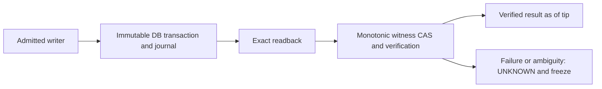

# CVF NCR HTML B2 Root Contract Reassessment

Memory class: governed-review

docType: review

Status: REASSESSMENT_COMPLETE_NO_DISPATCH

Date: 2026-10-02

providerExecutionAuthority: FORBIDDEN

## Purpose

Complete the Local source-only reassessment requested after R1 stopped. Select the smallest no-loss-restore witness/journal contract as a reviewable proposal, identify its missing runtime owners and preserve the terminal problem-chain boundary. This is not another worker revision or design ratification.

## Target / Source

Prior review `docs/reviews/CVF_CVF_NCR_HTML_B2_DESIGN_R1_LOCAL_REVIEW_2026-10-02.md` at 90eb9a5ed; selected regions of the R1 proposal, B2a precedent, Web generic adapter, v3 ledger, governance-event ledger and SCEC standard. The paired evidence `docs/reviews/evidence/cvf-ncr-html-b2-root-contract-reassessment-2026-10-02.json` binds seven declared source files and eleven unexecuted static reasoning scenarios. Source file hashes are captured now; no all-files or repository completeness claim.

## Scope / Methodology

Startup acknowledged: mode=cvf_ncr_p10_closed_p11_parked; handoff=AGENT_HANDOFF_V63_2026-09-18.md; next=source-only B2 root-contract reassessment; role=INTERNAL_AGENT Local orchestrator/reviewer; phase=source-only reassessment; technical owner=Local; effect owner=operator; parked=durable B2, Q001/Q004, P11 and real effects.

Read current continuity progressively, then the named owners and invariant 7. EVALUATE_RETURNED_EVIDENCE_NOT_RECREATE_IMPLEMENTATION: consume the R1 86-case plan and prior structural evidence without rerunning behavior. No database, browser, server, provider, lock, witness or transaction is opened or exercised. This reassessment does not change the three R1 worker outputs. External-relay/domain-funnel owners remain unchanged: shared-workspace implementation is INTERNAL_AGENT, external research advisory only.

## Source Verification Block

| Claimed item | Claim type | Source file | Verified line/section | Verified path or symbol | Owning interface/function/schema | Disposition |
|---|---|---|---|---|---|---|
| Scratch classification never grants retry or authority | SOURCE_BEHAVIOR | `EXTENSIONS/CVF_v1.6.1_GOVERNANCE_ENGINE/ai_governance_core/ledger_layer/sqlite_ledger.py` | classify_target | classify_target | governance-event ledger | ACCEPT source fact only |
| Restore verifies equality to backup, not freshness against acknowledged history | SOURCE_BEHAVIOR | `EXTENSIONS/CVF_v1.6.1_GOVERNANCE_ENGINE/ai_governance_core/ledger_layer/sqlite_ledger.py` | restore_backup; _copy_verified | restore_backup | governance-event ledger | ACCEPT bounded fact |
| Generic read initializes and write upserts | SOURCE_BEHAVIOR | `EXTENSIONS/CVF_v1.6_AGENT_PLATFORM/cvf-web/src/lib/storage-adapter.ts` | SQLiteKeyValueAdapter | SQLiteKeyValueAdapter | generic adapter | ACCEPT source fact; REJECT acceptance authority |
| In-memory content-hash dedup collapses decision identity | SOURCE_BEHAVIOR | `EXTENSIONS/CVF_v3.0_CORE_GIT_FOR_AI/artifact_ledger/artifact.ledger.ts` | ArtifactLedger.commit | ArtifactLedger | v3 ledger | ACCEPT source fact; REJECT durable owner |
| Witness/restore gap in proposed contract | PROPOSAL_EVIDENCE | `docs/reference/CVF_NCR_HTML_B2_DURABLE_ACCEPTANCE_DESIGN_2026-10-02.md` | sections 3 and 8 | journal; Freshness Witness Contract | R1 proposal | ACCEPT as unratified input |
| No same-problem successor after STOP | GOVERNED_RULE | `docs/reference/semantic_convergence_control/CVF_SEMANTIC_CONVERGENCE_AND_ESCALATION_CONTROL_STANDARD.md` | invariant 7 | No narrow successor after escalation | SCEC | ACCEPT |

## Findings / Position

Existing restore ownership does not answer the freshness question. `restore_backup` checks backup schema and rows, copies them to a verified staged target and refuses a preexisting final target. Its result proves equality to that backup. It does not compare with an independent high-water record of later acceptance or revocation. `classify_target` likewise does not promote a copied target to authority. Preserve these useful patterns without treating them as a B2 witness.

| Owner | Reusable value | Missing value | Disposition |
|---|---|---|---|
| Governance-event SQLite | strict verification, staged/no-clobber publication, copied classification with no retry/authority | independent artifact-history anchor, B2 exact actor/operation bytes, acceptance consumer | ADAPT patterns only |
| Web generic SQLite | existing SQLite loader | no-write read, immutable decisions, no-loss freshness proof | REJECT direct authority reuse |
| v3 ArtifactLedger | lineage concept | durability, exact bytes and actor/workspace decision distinction | REJECT direct authority reuse |
| R1 design | head-first lifecycle, immutable decisions, lifetime writer direction | complete witness publication and loss-restore contract | RETAIN unratified input |

This is a comparison of named owners, not a claim that no other repository owner exists. No existing source inspected here supplies the selected witness capability. Witness owner/backend and platform lock primitive remain UNKNOWN; this audit selects contracts, not implementations.

## Selected Minimal Root Contract

TAIL_ANCHOR_NO_LOSS_RESTORE_PROPOSAL_ONLY

1. One immutable store identity, one journal history and one admitted writer lifetime. No accepted-loss branch, sequence restart, restore-generation reset or automatic replacement of a witness/store identity. A stale store is quarantined, not made current by appending a RESTORE entry. Recovering lost acknowledged history remains a separate architecture problem.
2. Select failure model FM-1 for this proposal: accidental rollback/restore of the artifact database while its independent witness survives. Witness is outside that database's restore unit. Whole-host loss, coupled rollback, malicious file edits and unverified fsync/locking are not covered; absent independent provenance yields UNKNOWN. Real location, custody, backup, retention, availability and RPO/RTO stay operator-owned UNKNOWN.
3. The witness is a durable monotonic tip anchor `(storeId, formatVersion, seq, entryHash)`, not a duplicate artifact ledger or a best-effort governance event. The journal hash must bind each referenced immutable row's full decision/lifecycle data and exact-byte identity under a fixed, proposed serialization contract. Reading an anchor must provide one coherent observation; authentic provenance, consistency and durability assumptions require separate admission.
4. Proposed witness operations: read exact anchor; create the initial anchor only by explicit provisioning; advance by compare-and-set of the exact expected old tuple to a strictly larger sequence extending that old hash. Same exact completed request is idempotent; same sequence/different hash or stale expected tuple conflicts. No upsert, backward overwrite or implicit anchor initialization on read/accept. Mechanism, owner, authorization and durability are not implemented or selected here.
5. Initial provisioning is a separate authority boundary. Generate a new store identity and verified genesis journal, provision its matching witness anchor, read both back, then admit a writer. A half-provisioned store or missing witness never passes by creating the missing thing during a query. No provisioning occurs in this audit.
6. Every writer state-changing transaction follows a publication boundary: validate admitted writer and prior anchor; commit immutable rows/journal; read back the exact committed tip and referenced state; compare-and-set the witness; verify the resulting anchor; only then report a verified result or begin the next state-changing transaction. The two-transaction acceptance direction therefore publishes ATTEMPT before DECISION, with an independent witness publication for each. OS lock stays held across these phases. Cross-store atomicity is not claimed.
7. Database commit alone is historical commit evidence, not a witnessed acceptance acknowledgment. Witness failure or ambiguous response freezes subsequent writer admission/changes. Read-only reconciliation returns observations, never retry permission. An exact new anchor can establish that publication was observed; the old anchor only means not observed at that read, because an outstanding operation may still complete. No blind retry or automatic repair follows either observation. An authorized recovery owner may later use the admitted idempotent/CAS protocol after classifying the exact prefix and pending outcome; that separate action is not granted here.
8. Current/effective authority is verified only as of a stated anchor observation with an internally valid snapshot whose tip equals the anchor's sequence and hash. A larger snapshot tail is UNPUBLISHED_TAIL, even if it extends the anchor; do not call it current. A smaller tip is STORE_STALE. Same-sequence hash mismatch is STORE_CONFLICT. Missing, unreadable or ambiguous witness means UNKNOWN. Historical byte evidence can be separately labelled; no stale fallback or attribution across actors.
9. Read-only classification observes a valid copied snapshot and then the witness; equality establishes an as-of point, not a promise of permanent latest state. A concurrent changed anchor or inconsistent copy yields UNKNOWN or a new separately bounded read, never an acceptance write. Effective-head, revocation/expiry and exact-intent rules are evaluated within that same as-of snapshot.
10. No-loss restore eligibility is inspection only: absent-target staged copy, strict chain/row verification and equality to the independently witnessed tip. A backup below the mark is refused; a backup ahead of the mark is unpublished/UNKNOWN pending separately admitted reconciliation. No accepted-loss restore is available. Candidate publication, path selection, custody, writer restart and actual restore still need their own authorized effect and transaction proof.
11. A tip anchor is sufficient for this limited freshness decision because stale prefixes are refused wholesale. It need not reconstruct missing operation/lineage identifiers. Thus R1's proposed lost-range mapping and fork recovery are deliberately removed from this proposal, not solved by inventing more metadata. Tail hashes do not recover deleted rows.
12. OS writer-lock mechanism is a feasibility prerequisite: lifetime exclusivity, stable file identity, crash release, takeover and platform support must be demonstrated under a separately admitted synthetic contract. Existing SQLite dependency does not prove an OS lock is available or that no additional dependency/helper will be needed.

All nodes and operations are proposed; the diagram grants no execution.

## Static Boundary Scenarios

The eleven cases in the evidence JSON are reasoning examples, all NOT_EXECUTED_DESIGN_ONLY. They include seq-50 backup versus seq-100 anchor, equal matching tips, ahead/unpublished tail, conflicting hashes, missing witness, lost witness response, old/new anchor observations, lost revocation, CAS conflict and coupled rollback. They specify expected future discriminators; none proves behavior. Future oracles need independent byte/journal/witness observations and an actual platform mechanism, not only code under test returning a status.

## Risk / Corrective Action

Real witness and OS lock are still mandatory prerequisites for the selected real-write direction. A future synthetic proposal could use disposable stores and clearly labelled witness assumptions, but this document issues no worker packet. Extra anchor publication per transaction increases work and failure points; latency/cost are UNKNOWN and not estimated from static text. If that tradeoff is unacceptable, reassess the desired capability/authority boundary; do not silently replace the hard gate with an event log or a user-visible success after DB commit alone.

Do not overwrite R1, create a witness, choose real custody or amend governance in this tranche. The architecture proposal is a concrete checkpoint for future decisions; complete reassessment does not ratify runtime readiness or reopen the stopped problem chain.

## Decision / Disposition

REASSESSMENT_COMPLETE_NO_DISPATCH

Select the tail-anchor/no-loss-restore proposal for the architecture readout. B2_ACCEPTANCE_DESIGN_UNSPECIFIED remains unresolved; R1 remains unratified; no successor opened. The existing SCEC terminal block remains unchanged in `docs/reviews/CVF_CVF_NCR_HTML_B2_DESIGN_R1_LOCAL_REVIEW_2026-10-02.md`. This readout is not an active successor block or a new INITIAL chain.

Invariant 7 of `docs/reference/semantic_convergence_control/CVF_SEMANTIC_CONVERGENCE_AND_ESCALATION_CONTROL_STANDARD.md` states: "A predecessor at `STOP_REASSESS_ARCHITECTURE` cannot have another successor in the same problem chain." Therefore no R2, renamed reset, synthetic implementation or same-problem worker dispatch is issued. Any future progression requires a genuinely changed admitted objective/authority boundary or an explicitly governed change to that rule; this audit performs neither. Ordinary NEXT is not treated as permission to bypass it.

Next Local move: source-only selection of an independent roadmap lane, with owner/overlap checks and exact current authority before preparing a new packet. Durable B2, Q001/Q004, P11 and real effects remain parked. Operator custody facts are not fabricated or requested prematurely.

## Review Gate

Named-source raw hashes captured in the paired JSON; before status clean at `b855557f95e1e87fc0099505d5c3dd31228f7d44`. No behavioral verification. Required verification in this tranche is static artifact/trace/roadmap governance, one material commit and one separate continuity commit, followed by exact committed-range checks. Green gates validate shape, not the proposed witness.

## Review Cost And Boundary

M10/safety/source-only reassessment; no duplicate R1 suite; providerCallCount=0; worker invocation count=0. Token/elapsed usage NOT_AVAILABLE_WITH_REASON: no reliable turn meter recorded. One material plus one continuity planned. No completion review or executable proof claim.

## Corpus Completeness And Report Integrity

- Corpus verdict: NOT_APPLICABLE_WITH_REASON - seven declared selected-region source files for a bounded owner comparison, not a repository inventory or complete reading claim.

## Finding-To-Governance Learning Disposition

| Defect class | Learning lane | Disposition | Next control action |
|---|---|---|---|
| OPERATOR_SCOPE_CLARITY_GAP: verified backup equality confused with present-history freshness | DOCUMENTATION_ONLY_LEARNING | REASSESSMENT_COMPLETE_NO_DISPATCH | Preserve no-loss eligibility and publication semantics in architecture readout; no same-problem dispatch. |

N/A_WITH_REASON: runtime/provider/cost learning is not applicable; no mechanism was executed or economics measured.

## Epistemic Process Block

Expected Result / Prediction: an existing restore/classify owner may supply freshness semantics.

Evidence Comparison: restore verifies its backup, classification never grants authority, generic read/write is unsuitable, and the R1 loss branch lacks a complete witness contract.

Contradiction Or Gap Disposition: adapt useful patterns, propose a tail anchor and no-loss-only restore, leave capability feasibility and effect owners unknown.

Claim Update: source-only architecture readout complete; durable capability and integrated B2 design remain unratified.

## ADIF Defect Registry Disclosure

Command: `python governance/compat/run_adif_defect_resolver.py --task-class reviewer --role reviewer --lifecycle-phase review --json`. Returned defects NONE_RETURNED; totalCandidates=0; truncated=false. No claim that all rules are absent.

## Checker Source Read-Ahead Block

| Field | Evidence |
|---|---|
| applicableCheckersRead | `governance/compat/check_agent_operation_trace.py`; `governance/compat/check_governed_artifact_checker_read_ahead.py`; `governance/compat/check_markdown_structural_completeness.py`; `governance/compat/check_epistemic_process_packet.py`; unchanged SCEC/review-cost controls consumed from prior review |
| literalTokensReviewed | docType: review; Target / Source; Findings / Position; Risk / Corrective Action; Decision / Disposition; Agent Operation Trace Block; Public Export Disposition |
| gateRunPurpose | Confirm reassessment shape after source read-ahead; not discovery of required tokens. |
| claimBoundary | Static documentation only; terminal block unchanged, no runtime claim. |

## Agent Operation Trace Block

| Field | Evidence |
|---|---|
| Actor | Local orchestrator/reviewer |
| Provider or surface | private CVF shared workspace |
| Session or invocation | B2 root-contract source reassessment, 2026-10-02 |
| Working directory | repository root |
| Command or tool surface | named source reads, hashes, ADIF resolver, artifact gates, Git |
| Target paths | this review, paired evidence and roadmap D074 |
| Allowed scope source | current source-only reassessment checkpoint and operator NEXT |
| Before status evidence | clean worktree at b855557f95e1e87fc0099505d5c3dd31228f7d44 |
| After status evidence | three material paths only; R1/source/checkers unchanged |
| Diff evidence | git status --short; git diff --stat |
| Approval boundary | no worker or effect grant; terminal same-problem chain preserved |
| Claim boundary | proposed root contract and bounded source facts only |
| Agent type | INTERNAL_AGENT Local orchestrator/reviewer |
| Invocation ID | cvf-ncr-html-b2-root-contract-reassessment-20261002 |
| Expected manifest | `docs/reviews/CVF_CVF_NCR_HTML_B2_ROOT_CONTRACT_REASSESSMENT_2026-10-02.md`; `docs/reviews/evidence/cvf-ncr-html-b2-root-contract-reassessment-2026-10-02.json`; `docs/roadmaps/CVF_NONCODER_CONTROLLED_CAPABILITY_RUNTIME_ROADMAP_2026-09-26.md` |
| Actual changed set | `docs/reviews/CVF_CVF_NCR_HTML_B2_ROOT_CONTRACT_REASSESSMENT_2026-10-02.md`; `docs/reviews/evidence/cvf-ncr-html-b2-root-contract-reassessment-2026-10-02.json`; `docs/roadmaps/CVF_NONCODER_CONTROLLED_CAPABILITY_RUNTIME_ROADMAP_2026-09-26.md` |
| Manifest delta | MATCH |
| Deletion or rename disposition | N/A with reason: none |

## Claim Boundary

Proposed contract only, not a witness, OS lock, store, real account/custody choice, acceptance, provider proof, live pilot, Q001/Q004/P11 exit, public export or deployment. All scenarios NOT_EXECUTED_DESIGN_ONLY. No source/schema/runtime/guard mutation.

## Public Export Disposition

DEFERRED_PRIVATE_ONLY
